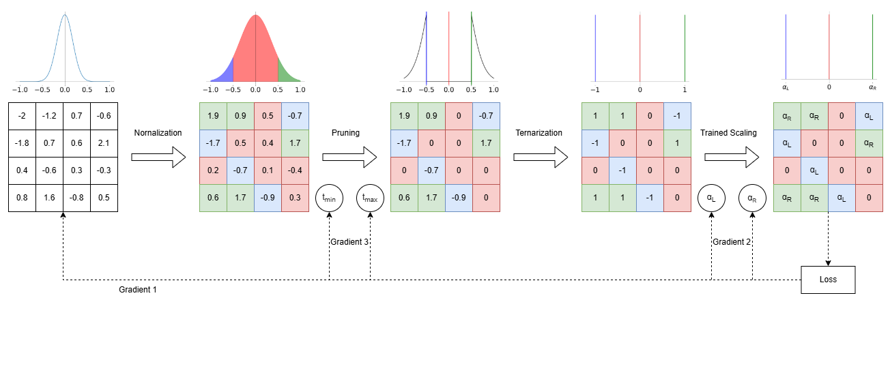

# EMA-pTTQ: Exponential Moving Average based Pruned Ternary Quantization

Repository for the paper _Extreme Compression of Neural Networks Using Exponential Moving Average based Pruned Ternary Quantization_, under revision at IEEE Transactions on Computers.

## Method

EMA-pTTQ quantizes neural network weights to ternary values {-w\_n, 0, +w\_p}, where w\_p and w\_n are learned per-layer scaling factors and zeros represent pruned weights. The method extends pTTQ (Pruned Trained Ternary Quantization) with two contributions:

1. **EMA-smoothed pruning thresholds.** Rather than computing pruning thresholds from instantaneous weight statistics (which fluctuate between optimization steps), EMA-pTTQ maintains exponential moving averages of the statistics. This stabilizes the pruning boundary and produces more consistent sparsity patterns during training.

2. **Tunable pruning aggressiveness.** A parameter _k_ scales the pruning threshold, giving direct control over the sparsity-accuracy tradeoff without retraining threshold parameters.

The quantization pipeline proceeds in four stages per layer:



- **Normalization:** Full-precision weights are centered and scaled using running statistics.
- **Pruning:** Weights within the EMA-smoothed threshold band [-delta, +delta] are zeroed. The thresholds are parameterized as delta = k * EMA(|mu + a * sigma|), where _a_ is a learnable parameter, _mu_ and _sigma_ are the layer's weight statistics, and the EMA decay factor _beta_ controls smoothing.
- **Ternarization:** Surviving positive weights become +1, negative weights become -1.
- **Scaling:** Two learned full-precision factors (w\_p for positive, w\_n for negative) are applied.

All parameters (w\_p, w\_n, _a_, and the full-precision weight copies) are trained end-to-end using the Straight-Through Estimator (STE) for gradient propagation through the discrete quantization.

## Supported Configurations

**Quantization methods:** FP (baseline), TTQ, DoReFaNet, pTTQ, EMA-pTTQ

**Image classification (CNN pipeline):**

| Dataset | Architectures |
|---------|--------------|
| MNIST, KMNIST, Fashion-MNIST, EMNIST | 2D CNN |
| CIFAR-10, CIFAR-100 | ResNet-18, ResNet-50, DenseNet |
| STL-10 | ResNet-50 |
| SVHN | ResNet-18, ResNet-50 |
| Tiny ImageNet | ResNet-50, ConvNeXt-Tiny |

**NLP (BERT pipeline):**

| Tasks | Model |
|-------|-------|
| CoLA, MRPC, RTE, STS-B, SST-2, QNLI | BERT-base-uncased |

## Setup

Tested on Linux with Python 3.10 and CUDA 12.8.

```bash
git clone git@github.com:SDMuhsin/Trainable-Pruned-Ternary-Quantization-with-Exponential-Moving-Average-Thresholds.git
cd Trainable-Pruned-Ternary-Quantization-with-Exponential-Moving-Average-Thresholds

python -m venv env
source env/bin/activate
pip install -r requirements.txt

export PYTHONPATH="${PYTHONPATH}:$(pwd)"
export TORCH_HOME=./data
export HF_HOME=./data
```

## Usage

All experiments are configured through JSON parameter files in `parameters_files/`. Results are written to `results/`.

### Image Classification

**1. Train a full-precision baseline:**

```bash
python src/Experiments/train_model_base.py \
    --parameters_file=./parameters_files/CIFAR10/cifar10_FP.json
```

**2. Quantize with EMA-pTTQ:**

```bash
python src/Experiments/experiment_pTTQ_experimental.py \
    --parameters_file=./parameters_files/CIFAR10/cifar10_experimental.json \
    --k_override=1.0 --beta=0.9
```

The `--k_override` flag controls pruning aggressiveness (default 1.0). Lower values reduce sparsity; higher values increase it.

Other quantization baselines:

```bash
# TTQ
python src/Experiments/experiment_TTQ.py \
    --parameters_file=./parameters_files/CIFAR10/cifar10_TTQ.json

# pTTQ
python src/Experiments/experiment_pTTQ.py \
    --parameters_file=./parameters_files/CIFAR10/cifar10_pTTQ.json

# DoReFaNet
python src/Experiments/experiment_DoReFaNet.py \
    --parameters_file=./parameters_files/CIFAR10/cifar10_doReFa.json
```

### BERT on GLUE

A single script handles all methods and tasks for the BERT pipeline. Results are appended to `results/glue_ternary.csv`.

```bash
# Full-precision baseline
python src/Experiments/train_glue_quantized.py \
    --task_name cola --method fp --epochs 3 \
    --seeds 41,42,43,44,45

# EMA-pTTQ (recommended config)
python src/Experiments/train_glue_quantized.py \
    --task_name cola --method ema_pttq \
    --warmup_epochs 2 --epochs 15 \
    --lr_quant 5e-6 --lr_thresh 0.01 --optimizer_thresh sgd \
    --scheduler_type constant_with_warmup \
    --k 1.0 --smart_initial_scales \
    --seeds 41,42,43,44,45

# pTTQ
python src/Experiments/train_glue_quantized.py \
    --task_name cola --method pttq \
    --warmup_epochs 2 --epochs 15 \
    --lr_quant 5e-6 --lr_thresh 0.01 --optimizer_thresh sgd \
    --scheduler_type constant_with_warmup \
    --k 1.0 --smart_initial_scales \
    --seeds 41,42,43,44,45

# TTQ
python src/Experiments/train_glue_quantized.py \
    --task_name cola --method ttq \
    --warmup_epochs 2 --epochs 15 \
    --smart_initial_scales \
    --seeds 41,42,43,44,45
```

The `--smart_initial_scales` flag initializes w\_p and w\_n from the full-precision weight distribution rather than 1.0. This is necessary for architectures that use LayerNorm instead of BatchNorm (BERT, ConvNeXt).

### HPC (SLURM)

Sbatch submission scripts for the full experiment suite are in `sbatch/`:

```bash
# Tiny ImageNet: FP baseline first, then all quantized methods
./sbatch/tinyimagenet_fp.sh --account def-myprof
# (wait for FP to finish)
./sbatch/tinyimagenet_quantized.sh --account def-myprof

# GLUE: all methods, all tasks, submitted in parallel
./sbatch/glue_all.sh --account def-myprof
```

## Repository Structure

```
parameters_files/       JSON configs per dataset and method
  MNIST/
  CIFAR10/
  TinyImageNet/
  ...
src/
  Experiments/          Training and quantization scripts
  Models/CNNs/          CNN architectures (ResNet, ConvNeXt, DenseNet, ...)
  Models/Transformers/  Transformer architectures
  DataManipulation/     Dataset loaders
  utils/                Pruning functions, compression utilities, result plotting
  triton_kernels/       Sparse ternary inference kernels
sbatch/                 SLURM submission scripts
results/                Output directory (created at runtime)
data/                   Dataset cache (created at runtime)
```

## Key Hyperparameters

| Parameter | Default | Description |
|-----------|---------|-------------|
| alpha | 10000 | Sigmoid steepness in the pruning function. Do not change. |
| k | 1.0 | Pruning threshold scaling factor. k < 1 reduces sparsity, k > 1 increases it. |
| beta | 0.9 | EMA decay factor for threshold smoothing. |
| init_x, init_y | 1.0 | Initial values for learnable threshold parameters _a_ and _b_. |
| smart_initial_scales | false | Initialize w\_p/w\_n from weight statistics. Required for LayerNorm architectures. |

## Utility Scripts

```bash
# Print best metrics across repetitions
python src/utils/getResultMetrics.py \
    --paramters_pth_file=./results/EXPERIMENT_ID/metrics/results*.pth

# Compute compression ratio between two models
python src/utils/getCompressionRate.py \
    --exp_folder_model_a ./results/FP_EXPERIMENT/ --is_model_a_ternarized False \
    --exp_folder_model_b ./results/QUANTIZED_EXPERIMENT/ --is_model_b_ternarized True

# Estimate energy consumption ratio
python src/utils/getEnergyConsumption.py \
    --exp_results_folder_ref ./results/FP_EXPERIMENT/ \
    --exp_results_folder ./results/QUANTIZED_EXPERIMENT/
```

## License

This project is licensed under the CeCILL-B license. See [LICENSE](LICENSE) for details.

## Contact

For questions or to request a preprint, contact Sayed Muhsin at sdmuhsin@gmail.com.
